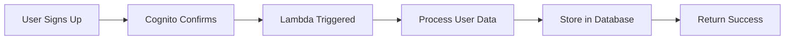

# 🧠 User Management Lambda

[](https://go.dev/)
[](https://aws.amazon.com/lambda/)
[](LICENSE)

A **Go-based AWS Lambda function** that handles **Cognito Post Confirmation events** to seamlessly process and store user data after successful registration.

---

## ✨ Features

- 🚀 **High Performance**: Built with Go for fast execution and minimal cold starts
- ☁️ **AWS Native**: Leverages AWS SDK v2 for optimal integration
- 🔐 **Cognito Integration**: Automatic trigger on user confirmation
- ⚡ **Serverless**: Runs on AWS Lambda with auto-scaling
- 🛠️ **Production Ready**: Includes secrets management and error handling

---

## 📁 Project Structure

```
user-management-lambda/
├── aws/
│   └── init.go          # AWS SDK configuration and initialization
├── models/
│   └── secret.go        # Data models for RDS secrets and user signup
├── main.go              # Lambda function entry point and handler
├── go.mod               # Go module dependencies
├── go.sum               # Dependency checksums
└── README.md            # Project documentation
```

---

## 🚀 Getting Started

### Prerequisites

- [Go 1.21+](https://go.dev/dl/) installed
- [AWS CLI](https://aws.amazon.com/cli/) configured with appropriate credentials
- AWS account with Lambda and Cognito access

### 1️⃣ Clone the Repository

```bash
git clone https://github.com/sanchezta/user-management-lambda.git
cd user-management-lambda
```

### 2️⃣ Install Dependencies

```bash
go mod download
go mod verify
```

### 3️⃣ Configure AWS Credentials

Ensure your AWS credentials are configured:

```bash
aws configure
```

Or set environment variables:

```bash
export AWS_ACCESS_KEY_ID=your_access_key
export AWS_SECRET_ACCESS_KEY=your_secret_key
export AWS_REGION=us-east-1
```

### 4️⃣ Build the Function

```bash
GOOS=linux GOARCH=amd64 go build -o bootstrap main.go
zip function.zip bootstrap
```

### 5️⃣ Deploy to AWS Lambda

```bash
aws lambda create-function \
  --function-name user-management-lambda \
  --runtime provided.al2023 \
  --handler bootstrap \
  --zip-file fileb://function.zip \
  --role arn:aws:iam::YOUR_ACCOUNT_ID:role/YOUR_LAMBDA_ROLE
```

### 6️⃣ Configure Cognito Trigger

1. Navigate to your Cognito User Pool in AWS Console
2. Go to **Triggers** → **Post confirmation**
3. Select your deployed Lambda function
4. Save changes

---

## 🔧 Configuration

### Environment Variables

| Variable        | Description                           | Required | Default |
| --------------- | ------------------------------------- | -------- | ------- |
| `AWS_REGION`    | AWS region for services               | Yes      | -       |
| `DB_SECRET_ARN` | ARN for RDS secret in Secrets Manager | Yes      | -       |
| `USER_TABLE`    | Database table name for users         | No       | `users` |

### IAM Permissions

Your Lambda execution role needs:

```json
{
	"Version": "2012-10-17",
	"Statement": [
		{
			"Effect": "Allow",
			"Action": [
				"logs:CreateLogGroup",
				"logs:CreateLogStream",
				"logs:PutLogEvents"
			],
			"Resource": "arn:aws:logs:*:*:*"
		},
		{
			"Effect": "Allow",
			"Action": ["secretsmanager:GetSecretValue"],
			"Resource": "arn:aws:secretsmanager:*:*:secret:*"
		}
	]
}
```

---

## 🧪 Local Testing

Run tests:

```bash
go test ./...
```

Test with sample event:

```bash
go run main.go < test-event.json
```

---

## 📊 Event Flow



---

## 🤝 Contributing

Contributions are welcome! Please feel free to submit a Pull Request.

1. Fork the repository
2. Create your feature branch (`git checkout -b feature/AmazingFeature`)
3. Commit your changes (`git commit -m 'Add some AmazingFeature'`)
4. Push to the branch (`git push origin feature/AmazingFeature`)
5. Open a Pull Request

---

## 📝 License

This project is licensed under the MIT License - see the [LICENSE](LICENSE) file for details.

---

## 👨‍💻 Author

**sanchezta**

- GitHub: [@sanchezta](https://github.com/sanchezta)

---

## 📞 Support

If you encounter any issues or have questions:

- 🐛 [Open an Issue](https://github.com/sanchezta/user-management-lambda/issues)
- 💬 [Discussions](https://github.com/sanchezta/user-management-lambda/discussions)

---

<p align="center">Made with ❤️ using Go and AWS</p>
